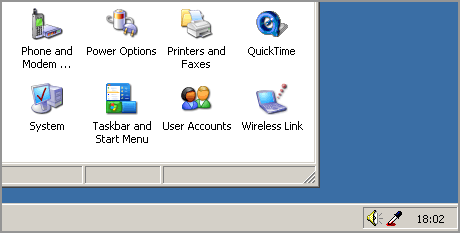

# HTML Color Picker
HTML Color Picker is a freeware Windows application that runs in your background, and allows you to easily pick any color from the screen.

## Requirements & installation
You should be able to run HTML Color Picker on most versions of Windows. After installing HTML color Picker, the application will start up automatically. Installation is included at **bin\hcp10.exe**.

## License
I've decided to release this code under [MIT-license](https://opensource.org/licenses/MIT) (see MIT.txt). Copyright © 2019 by Fredrik Johansson Robotics AB.

## Visual Basic 6.0 on Windows 10

To install Visual Basic 6.0 on Windows 10, please check out [Visual Studio 6 Installer](http://nuke.vbcorner.net/Articles/VB60/VisualStudio6Installer/tabid/93/language/en-US/Default.aspx).

